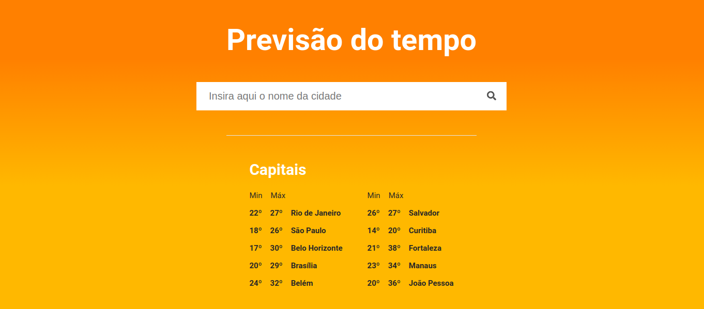

<h1 align="center">
    
</h1>

<p align="center">
  <a href="#-technologies">Technologies</a>&nbsp;&nbsp;&nbsp;|&nbsp;&nbsp;&nbsp;
  <a href="#-preview">Preview</a>&nbsp;&nbsp;&nbsp;|&nbsp;&nbsp;&nbsp;
  <a href="#-Getting-started">Getting started</a>&nbsp;&nbsp;&nbsp;|&nbsp;&nbsp;&nbsp;
  <a href="#-project">Project</a>
</p>

## 🧪 Technologies

This project was developed using the following technologies:

- [ReactJs](https://nextjs.org)
- [TypeScript](https://www.typescriptlang.org)
- [Sass](https://sass-lang.com)

## 🔥 Preview

[](https://previsao-do-tempo.pricarrenho.com.br)

## 🚀 Getting started

Clone the project and access the folder

```bash
$ git clone https://github.com/pricarrenho/previsao-do-tempo && cd previsao-do-tempo
```

Add environment

```bash
# Add your environment variable based on .env.example
VITE_WEATHER_API_KEY=//add here your weatherapi api
```

Follow the steps below

```bash
# Install the dependencies
$ npm install

# Start the project
$ npm start

```

Or with Yarn

```bash
# Install the dependencies
$ yarn install

# Start the project
$ yarn start

```

## 💻 Project

[Previsão do Tempo](https://previsao-do-tempo.pricarrenho.com.br) was developed to validate knowledge in ReactJs.

<br/>

---

<p align="center">
Made with 💜 by <a href="https://www.pricarrenho.com.br">Priscilla Carrenho</a> 
</p>
